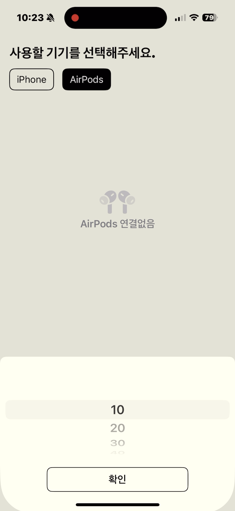
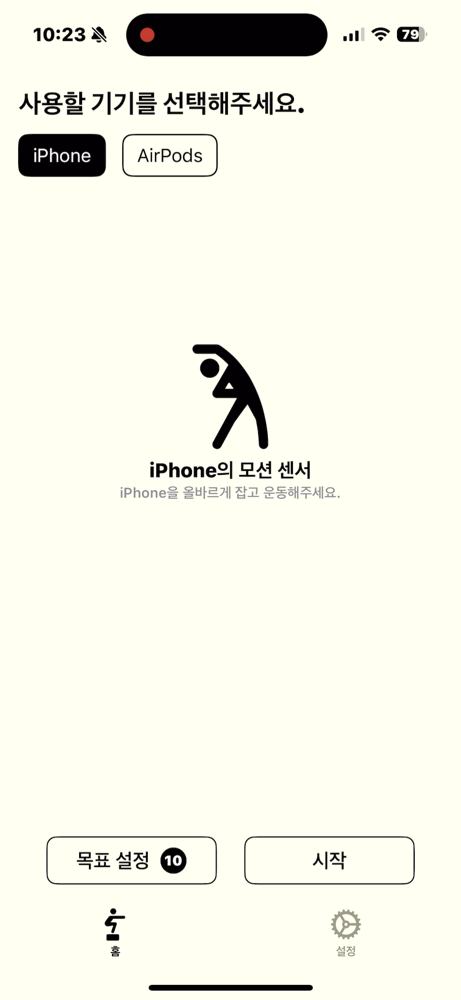
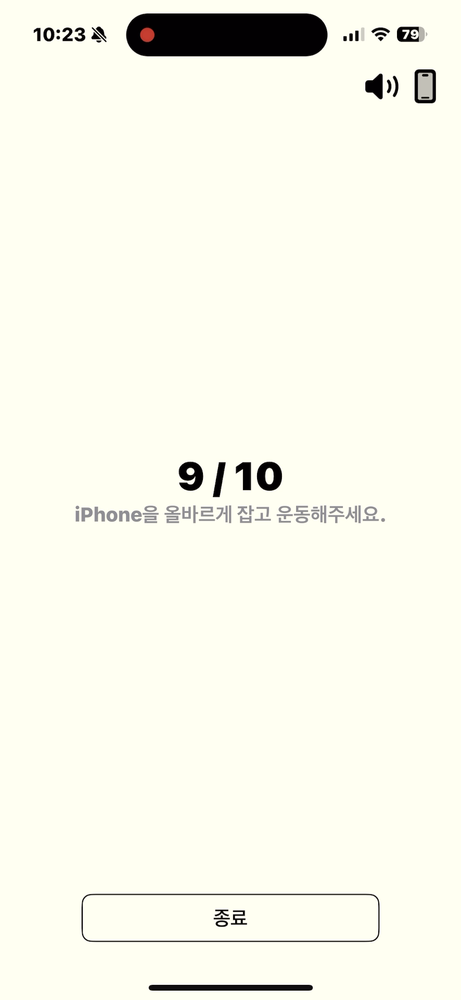
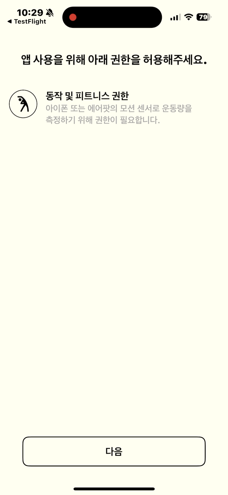
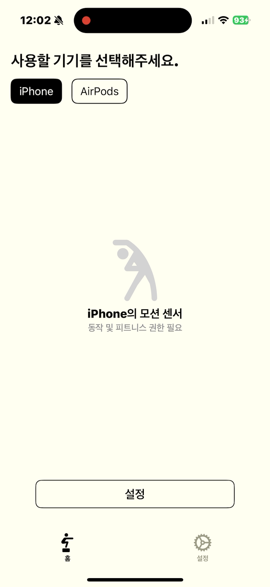
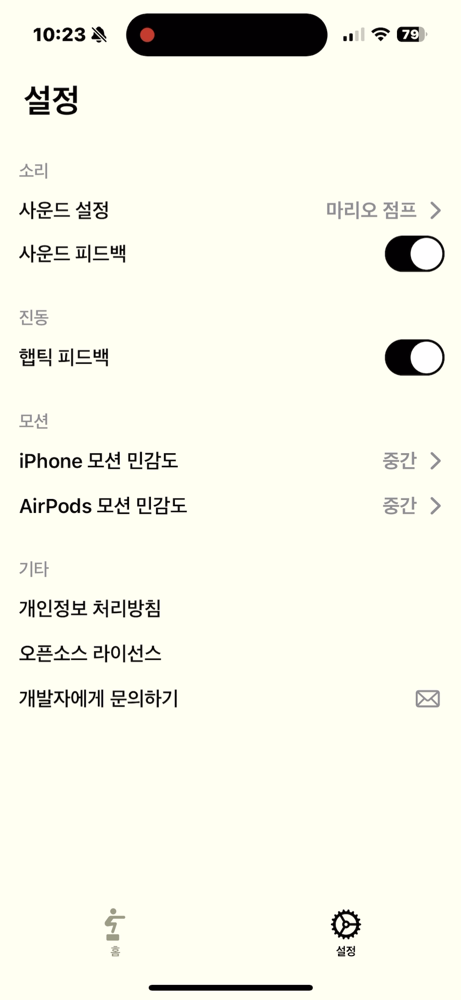
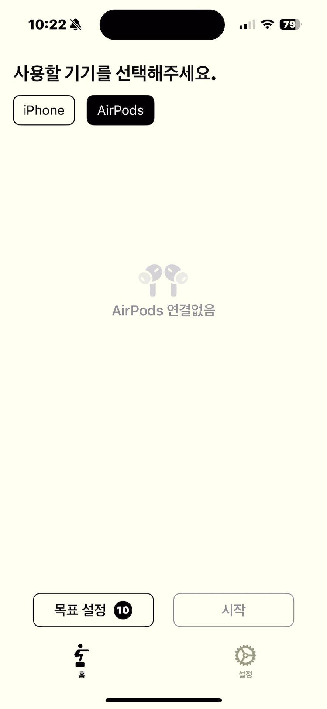

# 스쿼트 버디
아이폰, 에어팟의 모션 센서를 활용하여 자동으로 스쿼트를 감지하여 개수를 세주는 피트니스 앱 

[앱스토어 링크](https://apps.apple.com/kr/app/스쿼트버디/id6578448319)

# 사용 기술
- MVVM
- Swift, SwiftUI, Combine
- CoreMotion
- R.Swift
- DeviceKit

# 주요 기능
**스쿼트 카운팅 기능**: CoreMotion을 통해 아이폰과 에어팟의 가속도 변화를 정밀하게 감지하여 유저가 스쿼트를 했는지 감지하는 기능(정밀 감지를 위한 저역 통과 필터, 가속도, 시간 임계값 설정)
<p float="left">
    
    
    
</p>

**동작 및 피트니스 권한**: 동작 및 피트니스 권한을 설정하고, 권한 유무에 따른 UI, 설정화면 리다이렉팅
<p float="left">
    
    

</p>

**스쿼트 민감도 설정 기능**: 사용자마다 다를 수 있는 스쿼트의 속도, 강도를 아이폰, 에어팟마다 다르게 설정
<p float="left">
    
</p>

**헤드폰 착용 여부 감지**: AVFAudio를 사용하여 에어팟 착용, 미착용 상태를 감지
<p float="left">
    
</p>

**문의하기**: 아이폰에 등록된 기본 메일 앱을 통한 문의하기 기능, 문의 내용에 디바이스 종류, os, 앱 버전을 자동으로 작성
<p float="left">
    
</p>

# 트러블 슈팅 및 배운 점
### 사운드 매니저 관련
스쿼트 1회 성공 마다 유저에게 사운드 피드백을 주고 있다. `AVAudioPlayer`를 생성하고 성공 할 때마다 `play` 메소드를 실행시켰는데, 사운드의 길이가 2초여서 스쿼트를 1초마다 하면 이전에 재생중이던 사운드가 있어서 제대로 사운드 피드백을 주지 못했다.

따라서 매 사운드 재생마다 새로운 `AVAudioPlayer` 인스턴스를 생성해주기로 했다. 다만 계속 새로운 인스턴스를 생성해두면 메모리 성능 이슈가 생길 수 있으므로 사운드 재생 후 메모리로부터 `AVAudioPlayer`를 해제해주어야 했다.

```swift
extension SoundManager: AVAudioPlayerDelegate {
    func audioPlayerDidFinishPlaying(_ player: AVAudioPlayer, successfully flag: Bool) {
        delegate?.didFinishPlaying(self)
    }
}
```

다행히도 `AVAudioPlayer`는 델리게이트를 통해 사운드 재생이 끝나는 시점을 알려주었다.

위 델리게이트를 `SoundManager`를 준수하는 `SoundManagerDelegate`에 한 번 더 래핑을 해주었다.

래핑을 해주는 이유는 이 `SoundManager`를 사용하는 뷰모델과 AVFAudio의 의존성을 끊기 위함이다.

```swift
protocol SoundManagerDelegate: AnyObject {
    func didFinishPlaying(_ soundManager: SoundManager)
}
```

```swift
extension SquatViewModel: SoundManagerDelegate {
    
    func playSound() {
        let sound = SoundManager()
        sound.delegate = self
        soundManagers.append(sound)
        sound.play()
    }
    
    func didFinishPlaying(_ soundManager: SoundManager) {
        if let index = soundManagers.firstIndex(of: soundManager) {
            soundManagers.remove(at: index)
        }
    }
}
```

그리고 매 사운드 재생마다 `SoundManager` 인스턴스를 생성하고 배열에 넣어주었다가, 재생이 끝나면 배엘에서 제거함으로서 메모리에서 제거해주었다.

이렇게 delegate를 통해서 `SoundManager`의 참조를 `ViewModel`에서 약하게 하고 스택 영역에 존재하는 배열에 넣어두었다가 제거를 해주면 상대적으로 무거운? 작업인 사운드 재생을 여러개의 인스턴스로 하면서도 자연스럽게 메모리에서 해제되도록 할 수 있다.

### 스쿼트 감지, 저역 통과 필터
아이폰, 에어팟의 가속도계는 굉장히 민감하기 때문에 정말 조금만 움직여도 변하게 된다. 이 가속도로 스쿼트 여부를 체크를 해야했기 때문에 신뢰성 있는 데이터만 받아야 했다.

실제로 CoreMotion에서 가속도 데이터를 로우하게 출력하면 정말 많은 데이터가 디바이스를 가만히 두더라도 계속해서 변화하는 것을 볼 수 있다.

이 데이터로만 스쿼트를 감지했더니 잘못 감지하는 경우가 너무 많았다.

그래서 스쿼트 감지를 정밀하게 하기 위하여 아래 3가지 필터를 적용하였다.

1. 시간 임계 필터
   - 마지막 스쿼트 시점으로 부터 어느정도 시간이 지나야 스쿼트로 인정
2. 저역 통과 필터
   - 가속도계는 예민하기 때문에 급격하게 큰 변화가 생기는 것을 막아줌
3. 스쿼트 상태 구체화(descending, bottom, ascending)
   - 디바이스가 내려가고 있는지 올라가고 있는지를 상태를 구분

### 앱 스토어 업로드
  
앱 스토어에 앱을 처음으로 업로드 해보았다. 앱을 사용자들이 사용할 수 있도록 업로드 한다는 것은 코드 작성 이외에도 신경써야 할 부분이 많다는 것을 알게 되었다. 알고 있었지만 직접 해보는 경험은 처음이었다.

- 아이폰 사이즈에 맞는 스크린 샷 업로드
- 다국어를 지원한다면 각 언에 맞는 앱 제목, 스크린샷, 프로모션 텍스트, 설명 등... Localizable만 하면 되는 것이 아니었다.
- 키워드
- 개인정보 처리방침, 이용약관
- 저작권

# 기술 블로그 작성

[CMHeadPhoneManager 사용해보기](https://medium.com/peppermint100/cmheadphonemanager-%EC%82%AC%EC%9A%A9%ED%95%B4%EB%B3%B4%EA%B8%B0-8aada1fd8e5f)

[Swift로 AirPods 연결 감지하기](https://medium.com/peppermint100/swift%EB%A1%9C-airpods-%EC%97%B0%EA%B2%B0-%EA%B0%90%EC%A7%80%ED%95%98%EA%B8%B0-661bf37fc606)